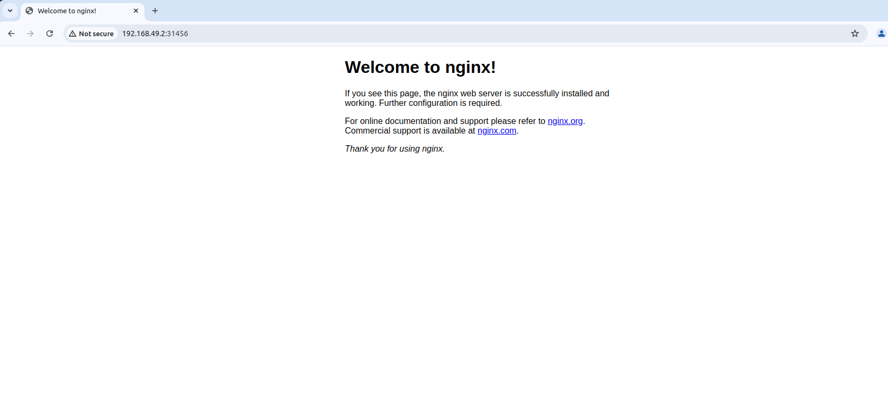

## Deploy the Application
- Run the following commands to deploy the web app:
```bash
kubectl apply -f deployment.yaml
kubectl apply -f service.yaml
```
- Check if the pods are running:
```bash
kubectl get pods
```
Output:
```out
girish@girish:~/code0/kubernetes$ kubectl get pods
NAME                             READY   STATUS              RESTARTS   AGE
sample-webapp-7674d86d4c-f85bv   0/1     ContainerCreating   0          30s
sample-webapp-7674d86d4c-pjlg2   0/1     ContainerCreating   0          30s
girish@girish:~/code0/kubernetes$
```
- Check the service:
```bash
kubectl get svc
```
Output:
```out
girish@girish:~/code0/kubernetes$ kubectl get svc
NAME                    TYPE        CLUSTER-IP      EXTERNAL-IP   PORT(S)        AGE
kubernetes              ClusterIP   10.96.0.1       <none>        443/TCP        43m
sample-webapp-service   NodePort    10.107.132.12   <none>        80:31456/TCP   36s
girish@girish:~/code0/kubernetes$ 
```
- If using Minikube, get the URL of the service:
```bash
minikube service sample-webapp-service --url
```
Output:
```out
girish@girish:~/code0/kubernetes$ minikube service sample-webapp-service --url
http://192.168.49.2:31456
girish@girish:~/code0/kubernetes$ 
```

- Other way to get the URL:
```bash
http://<NODE-IP>:<NODE-PORT>
# To get the NODE-IP
kubectl get nodes -o wide
# To get the NODE-PORT
kubectl get service sample-webapp-service
```

- The web page looks like below:

